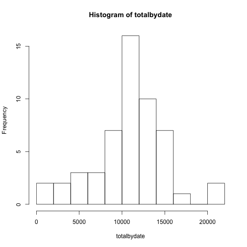
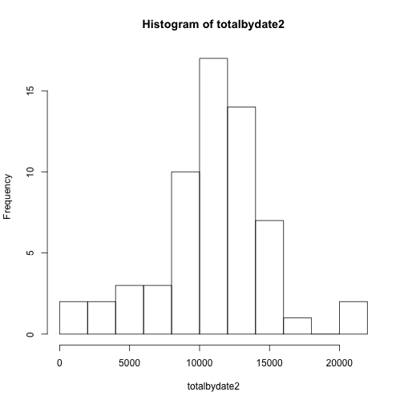
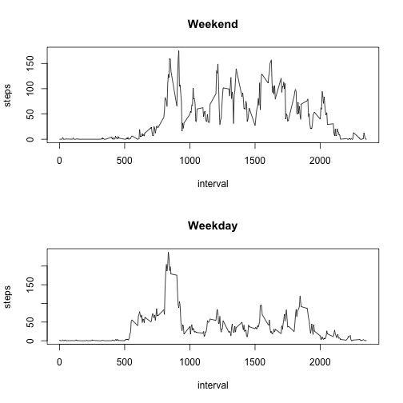

This assignment makes use of data from a personal activity monitoring device. This device collects data at 5 minute intervals through out the day. The data consists of two months of data from an anonymous individual collected during the months of October and November, 2012 and include the number of steps taken in 5 minute intervals each day.  We will be analyzing various aspects of this data, and presenting the results achieved.

## Loading and preprocessing the data
First, to load and prep the data, the CSV must be extracted from the activity.zip, and the date column properly coerced into being parsed as a date, following the file's date formatting ('yyyy-mm-dd') - not doing this results in the date being a factor.  


```r
setClass("yyyymmddDate")
setAs("character","yyyymmddDate", function(from) as.Date(from, format="%Y-%m-%d") )
data <- read.csv(unz("activity.zip", "activity.csv"), colClasses=c("numeric", "yyyymmddDate", "numeric"))
```

Also, for convenience with exploration, add a timestamp column derived from the combination of the date and the interval.  Note: one key detail of the raw data is that the **interval** column represents the time of day of the sample as the hour in the day in the hundreds position (3rd and 4th digits), and the minute within the hour in the lower 2 digits.  This must be considered when properly mapping the data to a timestamp.


```r
data$timestamp <- as.POSIXlt(data$date) + (3600 * (data$interval %/% 100)) + (60 * (data$interval %% 100))
```

Lastly, add columns for easily selecting by day of week, and for weekend versus weekday days.


```r
data$dow <- weekdays(data$date)
data$weekend <- data$dow %in% c("Saturday", "Sunday")
```

## What is mean total number of steps taken per day?
To compute the mean of the total steps per day, we will need to first aggregate the steps for each distinct day, and then average the results.  We will also produce the median of these totals.


```r
totalbydate <- tapply(data$steps, data$date, FUN=sum)
averageperday <- mean(totalbydate, na.rm=TRUE)
medianperday <- median(totalbydate, na.rm=TRUE)
```

A histogram of the totals per day can be generated to show the resulting data summarization.


```r
hist(totalbydate, breaks=10)
```

 

From this, it can be seen that the computed average, 10766.19 steps per day, is also consistent with the most frequent range of values on the histogram.  Further, the median per day, 10765 steps per day, is also quite consistent with both the shape of the histogram and the calculated average.

One significant result here is the need to account for missing days.  Examining the sums for the days shows that 8 days have no step data (that is, NA for all counts).  Reviewing the raw data, it appears that the collection and reporting methodology was such that missing data is always on a full day basis - either a day has data for all intervals, or for none.  This is an important finding for later, when we will involve strategies for coping with missing data.

## What is the average daily activity pattern?
For daily activity pattern, we will be producing data representing the mean steps per interval across all the days in the provided data set, and then presenting the resulting values graphically.

First, we will generate the vector of average values for each distinct **interval** value, and then produce the corresponding average (with NA values for missing days ignored).  

```r
meanperinterval <- aggregate(steps ~ interval, data=data, mean, na.rm=TRUE)
```

We also need to find the interval corresponding to the highest activity average.

```r
maxintervalvalue <- max(meanperinterval$steps)
meanperinterval[meanperinterval$steps == maxintervalvalue,]
```

```
##     interval steps
## 104      835   206
```

Plotting the average daily activity supports this peak (corresponding to 206 steps/interval at 8:35 AM).


```r
plot(meanperinterval, type="l")
```

 

## Inputing missing values

The presence of missing data values can certainly have an impact on the analysis of the data.  The number of rows missing data is determined below:


```r
length(data[is.na(data$steps),"steps"])
```

```
## [1] 2304
```

To fill in the data, we will work from the assumption that the average for a given interval among the days that are the same day of the week is most likely to represent the data.  This will work well whether or not the activity is a function of the day of the week, since it being so will reflect and preserve that effect, while it not being so (that is, the activity not being a function of the day of the week) should mean that the average of a subset of the days is approximatey the same as the overall average.  To implement this mapping into a new data set, we do the following:

- First, compute the mean for each unique interval and day-of-the-week:

```r
meanIntDow <- aggregate(steps ~ interval + dow, data=data, mean, na.rm=TRUE)
```
- Then, create a new data set, and replace the **steps** values that are **NA** with the corresponding value from the above data:

```r
data2 <- data
for (r in 1:nrow(data2)) {
  if (is.na(data2$steps[r])) {
    data2$steps[r] <- meanIntDow[meanIntDow$dow == data2$dow[r] & meanIntDow$interval == data2$interval[r], "steps"]
  }
}
```

Once done, we can repeat our previous calculations of the total steps per day, as well as overal mean and median values.


```r
totalbydate2 <- tapply(data2$steps, data2$date, FUN=sum)
averageperday2 <- mean(totalbydate2, na.rm=TRUE)
medianperday2 <- median(totalbydate2, na.rm=TRUE)
```

The updated histogram of the totals per day can be generated to show the resulting data summarization.


```r
hist(totalbydate2, breaks=10)
```

 

The resulting mean steps per day is now 10821.21, versus our previous value of 10766.19.  Our median is now 11015 versus our previous value of 10765.  The result is a small, but non-zero, change in both values (0.51% and 2.32% increases, respectively).

## Are there differences in activity patterns between weekdays and weekends?

To evaluate differences between weekend and weekday activity, we will split the data set into two distinct sets, and repeat the previous calculations.  To split the set, we do the following:


```r
dataweekend <- data2[data2$weekend == TRUE,]
dataweekday <- data2[data2$weekend == FALSE,]
```

From here, we can repeat the calculations of average activity for the various intervals:


```r
meanperintervalweekend <- aggregate(steps ~ interval, data=dataweekend, mean)
meanperintervalweekday <- aggregate(steps ~ interval, data=dataweekday, mean)
```

And recompute the averages and medians:


```r
totalbydateweekend <- tapply(dataweekend$steps, dataweekend$date, FUN=sum)
averageperdayweekend <- mean(totalbydateweekend)
medianperdayweekend <- median(totalbydateweekend)
totalbydateweekday <- tapply(dataweekday$steps, dataweekday$date, FUN=sum)
averageperdayweekday <- mean(totalbydateweekday)
medianperdayweekday <- median(totalbydateweekday)
```

Comparing activity across the intervals between weekends and weekdays yeilds the following plots:


```r
par(mfrow=c(2,1))
plot(meanperintervalweekend , type="l", main="Weekend")
plot(meanperintervalweekday , type="l", main="Weekday")
```

 

What is clear from the graphs is that the weekend data shows more consistent activity during the day.  Comparing the weekend versus weekday averages and medians also supports this:

- Average per day (weekend): 12406.57

- Average per day (weekday): 10257.53

- Median per day (weekend): 12351.86

- Median per day (weekday): 10304
